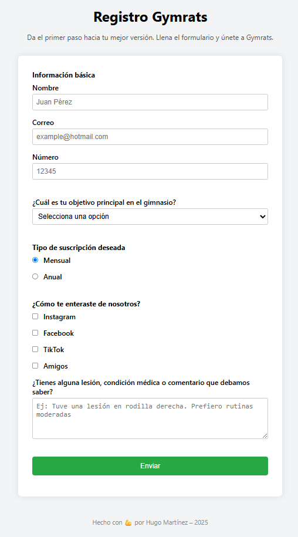

🏋️‍♂️ Registro Gymrats

Formulario de inscripción al gimnasio Gymrats, desarrollado como proyecto de certificación para el curso de Responsive Web Design de FreeCodeCamp.

🧰 Tecnologías utilizadas
HTML5

CSS3

Visual Studio Code

Live Server (para pruebas locales)

✅ Funcionalidades
Validación HTML5 para nombre, correo y número.

Dropdown personalizado para elegir objetivos.

Radios para tipo de suscripción.

Checkboxes para saber cómo conocieron el gimnasio.

Textarea para comentarios médicos.

Diseño responsive básico.

🧠 Aprendizajes clave
Uso de fieldset, legend, label, input, textarea, select.

Conexión semántica con id y for.

Accesibilidad mínima cumplida.

Estilo visual con CSS (hover, padding, color, etc.).

🚀 Cómo verlo
Clona este repositorio

Abre index.html en tu navegador

O usa Live Server desde VS Code

👤 Autor
Hugo Martínez

Año: 2025

Proyecto personal de práctica

